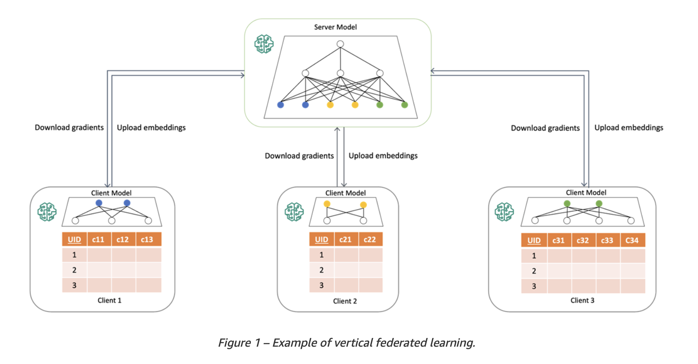
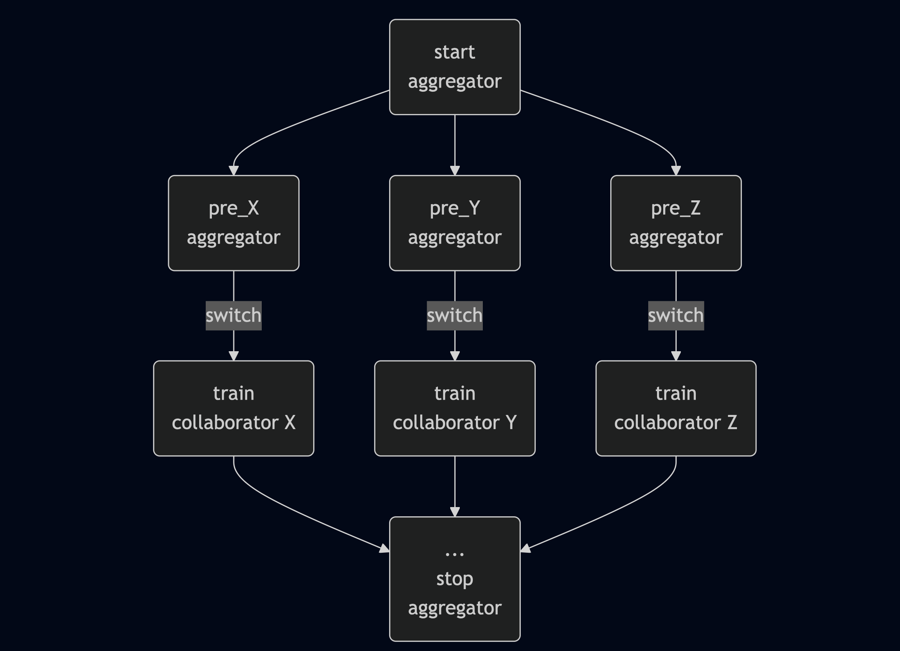
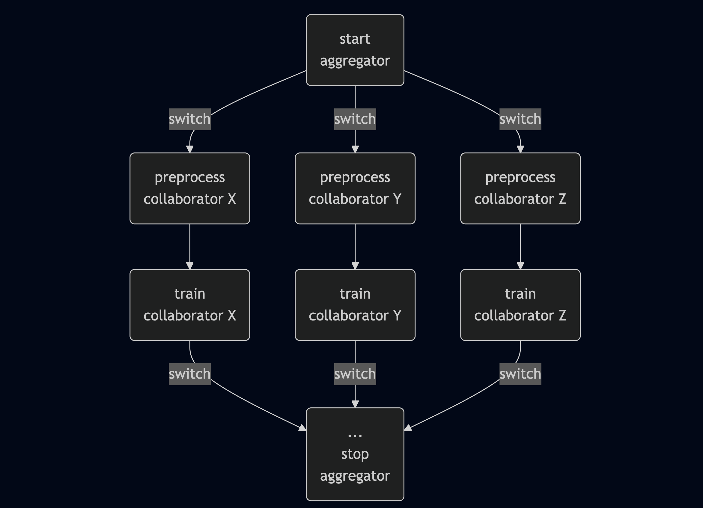

# Branching in Workflow API

## Summary
What is branching? How will it be helpful? Explain.

## Not in Scope
- Branching is not a way to achieve parallel compute or processing in Workflow API.
- Collaborator steps branching to multiple aggregator joins.

## Motivation
Vertical FL - what is it and how is it useful?


### Current Design and Limitations
How vertical FL can be achieved with the current workflow API?
Limitations/shortcomings of the current design.

## Proposed Approach
For the first phase of this functionality, we propose to allow usage which can be limited to the following three use cases.
- Within the aggregator steps
  ```
    @aggregator
    def aggregator_step():
        self.next(self.aggregator_branch1, self.aggregator_branch2)
    
    @aggregator
    def aggregator_branch1():
        self.next(self.join)
        
    @aggregator
    def aggregator_branch2():
        self.next(self.join)
  ```
  This can be further extended to go to collaborator steps from each of the aggregator branch such as
  
- Within the collaborator steps
    ```
    @collaborator
    def collaborator_step():
        self.next(self.collaborator_branch1, self.collaborator_branch2)
    
    @collaborator
    def collaborator_branch1():
        self.next(self.join)
        
    @collaborator
    def collaborator_branch2():
        self.next(self.join)
    ```
    Within the collaborator, we should be able to allow any branhing which can be validated by metaflow.
- Aggregator to collaborator switch
    ```
    @aggregator
    def aggregator_step():
        collaborators = ["collaborator1", "collaborator2"]
        self.next(self.collaborator_branch1, self.collaborator_branch2, foreach=["collaborators"])

    @collaborator
    def collaborator_branch1():
        self.next(self.join)
        
    @collaborator
    def collaborator_branch2():
        self.next(self.join)

    ```
    Here, the caveat being that the number of branches should be equal to the number of collaborators; in the above example, the count of both being 2.
    
    
Allowing these variations can also help achieve more complex flows such as (<add an example...?)

## Open Questions
## Alternatives Considered
## Next Steps